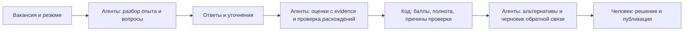
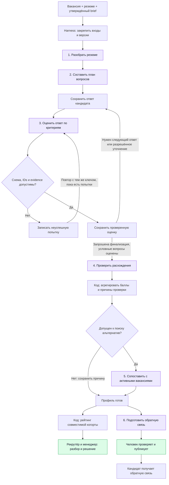

# Мультиагентное интервью: разбор, улучшения и схема объяснения

Дата: 2026-09-05. Основание: код и локальные тесты репозитория.
Область изменений: действующий FastAPI backend в `backend/`; отдельный POC
`interview_platform/` не переносился в этот поток.

**Вывод:** архитектура уже разделяет полезные обязанности между шестью LLM-ролями и
детерминированным оркестратором. Основные найденные проблемы относятся к расчёту результата,
сопоставимости требований и восстановлению операций. Они исправлены ниже. Качество суждений
LLM о реальных кандидатах этими тестами не измерено.

## Как объяснить за минуту

> Мы разделили интервью на шесть специализированных AI-ролей. Первая разбирает резюме и выделяет
> заявления, которые нужно проверить. Вторая составляет вопросы на основе общего ядра и опыта
> кандидата. Третья оценивает каждый сохранённый ответ, связывая выводы с фрагментами ответа,
> и при необходимости предлагает ограниченное число уточнений. Четвёртая ищет расхождения
> между резюме и ответами. После этого обычный код рассчитывает оценки и полноту данных.
> Пятая роль ищет подходящие альтернативные вакансии для подтверждённых профессиональных
> профилей, шестая готовит понятную обратную связь. Оркестратор проверяет результаты всех ролей
> и сохраняет историю. Решение о кандидате и публикацию обратной связи подтверждает человек.

Короткая схема для устного объяснения:



Альтернативы предлагаются только при выполнении правил допуска. Их отсутствие не означает
кадровый отказ. Резюме задаёт гипотезы для вопросов; доказательством навыка служит ответ.

## Что действительно реализовано

Это один `MultiAgentHarness` с шестью специализированными адаптерами. Роли имеют разные
инструкции и схемы ответа; фабрика по умолчанию передаёт им одну настройку модели. Вызовы
последовательны. В коде нет голосования шести независимых экспертов или распределённого
«совета агентов».

| Роль | Что получает | Что возвращает | Граница ответственности |
|---|---|---|---|
| `resume_relevance` | Вакансию, резюме, утверждённый brief | Позиции, заявления об опыте, соответствия требованиям | Совпадение резюме не подтверждает навык |
| `question_plan` | Общее ядро, заявления, требования менеджера | Неизменённое ядро и персональные вопросы | Не меняет критерии и веса |
| `answer_assessment` | Один сохранённый ответ, вопрос, критерии | Наблюдения, evidence IDs, возможное уточнение или coding | Не принимает решение о найме |
| `integrity_check` | Резюме и собственные ответы кандидата | Расхождения с двумя источниками и вопросом для проверки | Не устанавливает ложь и не создаёт ограничение |
| `alternative_vacancy_match` | Допущенный профиль, evidence, одну активную вакансию | Совпадения, пробелы и предложенный fit | Не переводит кандидата автоматически |
| `candidate_feedback` | Профиль, ответы, разрешённые альтернативы | Черновик обратной связи с источниками | Публикация требует действия человека |

Отдельный агент подготовки manager brief находится до этого потока: его черновик начинает
влиять на интервью после утверждения менеджером. Он не входит в перечисленные шесть ролей.

## Подробная схема



Схема показывает зависимости сервисных вызовов. Проверка схемы и сохранение попыток применяются
ко всем шести ролям; для читаемости подробно раскрыта только оценка ответа. Автоматический
запуск всего графа после загрузки записи пока требует интеграции, описанной в ограничениях.

Уточнений сейчас не больше двух за сессию, live coding — не больше одного. Условный вопрос
не может порождать следующий условный вопрос. Числовая оценка должна ссылаться на ID точного
фрагмента сохранённого ответа. Такая проверка доказывает существование источника, но не
правильность его интерпретации моделью.

## Найденные проблемы и внесённые исправления

| Подтверждённая проблема до изменений | Последствие | Изменение |
|---|---|---|
| `CriterionDefinition.weight` не участвовал в расчёте dimension | Заданные веса не влияли на результат | Взвешенное среднее по оценённым критериям вынесено в отдельный модуль |
| Общая готовность включала primary vacancy fit и использовалась для допуска к альтернативам | Профессионал мог потерять альтернативы из-за несовпадения с исходной вакансией | Добавлены `professional_readiness` и `professional_coverage` без vacancy fit |
| Для допуска к альтернативам не было отдельного технического порога | Высокие другие блоки компенсировали слабую или неоценённую технику | Дополнительная проверка technical readiness и coverage |
| Противоположные наблюдения усреднялись, отдельного сигнала не было | `+1` и `−1` выглядели как обычный нейтральный результат | `conflicting_evidence:<criterion_id>` в профиле и рейтинге |
| Низкая уверенность модели могла исчезнуть за средним confidence | Неуверенный вывод выглядел достаточно надёжным | `low_confidence:<criterion_id>` по каждому числовому наблюдению ниже порога |
| Ключ рейтинга не включал manager brief | В одной когорте могли оказаться разные ожидания менеджера | В v2 сравнивается закреплённый hash brief, включая его отсутствие |
| Остаток бюджета уточнений менял hash повторного запроса оценки | Повтор успешного запроса после уточнений давал конфликт | Стабильная идентичность операции отделена от полного контекста конкретного вызова |
| Инструкция допускала `weak` только за недостающие детали | Недостаток evidence мог превращаться в отрицательную оценку | В инструкции `weak` требует конкретного отрицательного evidence; мешающий оценке пробел получает `insufficient_information` |

Порог уверенности используется как сигнал для проверки; его значение не является вероятностью
правильности ответа или найма. Спорная оценка приостанавливает автоматическое предложение
альтернатив, оставаясь видимой рекрутёру. Она не превращается в обвинение в недостоверности.

## Как считается оценка

### Наблюдение по одному критерию

| Метка | Значение | Значение для объяснения |
|---|---:|---|
| `strong` | +1 | Сильное релевантное подтверждение критерия |
| `supported` | +0.5 | Есть положительное подтверждение |
| `neutral` | 0 | Есть смешанное evidence |
| `weak` | −0.5 | Есть конкретное отрицательное evidence |
| `contradicted` | −1 | Ответ противоречит ожидаемому признаку |
| `insufficient_information` | `null` | Имеющихся данных недостаточно |

**Ноль и отсутствие данных различаются.** У нуля есть evidence, у `null` — информационный пробел.
Баллы относятся к содержанию ответа. Внешность, акцент, эмоции и уверенность голоса не оцениваются.

### Агрегация

```text
criterion_value = среднее числовых наблюдений данного критерия

dimension_value = сумма(criterion_value × criterion_weight)
                  / сумма весов оценённых критериев

dimension_coverage = число оценённых критериев / число применимых критериев

overall_readiness = среднее оценённых dimensions, включая vacancy_fit
professional_readiness = среднее оценённых dimensions без vacancy_fit
professional_coverage = доля оценённых критериев без vacancy_fit

candidate_score_10 = (overall_readiness + 1) × 5
```

При отсутствии числового evidence значение остаётся `null`. Веса не заполняют отсутствующие
данные и не меняют coverage. Веса действуют внутри блока; между оценёнными блоками остаётся
равное усреднение. В текущем базовом ядре все веса равны 1, поэтому исправление весов само по
себе не меняет его баллы. Настройка содержательной rubric менеджером ещё требует развития.

Количество ответов не увеличивает общий вес критерия: сначала усредняются его наблюдения.
Уточнения могут изменить это среднее. Повторная оценка того же ответа заменяет выбранный
assessment в новом профиле; история старых артефактов сохраняется.

Отдельно сохраняется средний confidence модели. Он не умножается на балл кандидата. Значение
`7.5/10` — отображение оценки данного интервью; оно не означает 75% вероятности успешной работы.

### Допуск к альтернативным вакансиям

Текущие настройки по умолчанию для `strong_pool_v2`:

| Условие | Порог |
|---|---:|
| Профессиональная готовность | ≥ 0.25 |
| Полнота профессионального evidence | ≥ 0.50 |
| Техническая готовность | ≥ 0.25, значение обязательно |
| Полнота technical evidence | ≥ 0.50 |
| Низкий confidence числового наблюдения | < 0.65 создаёт причину проверки |
| Противоположные наблюдения одного критерия | Требуют проверки |
| Существенные integrity flags или действующее человеческое ограничение | Допуск приостановлен |

Это настройки MVP, а не подтверждённые исследованием пороги качества найма. Они закрепляются
в сессии. Проверка assessment сейчас не имеет отдельной кнопки «снять флаг»: уточнение или
переоценка создают новые артефакты, а кадровое решение человек принимает отдельно.

## Примеры для демонстрации — synthetic

Все значения ниже вымышлены для объяснения алгоритма. Это не интервью реальных кандидатов
и не клиентская валидация. Для первых двух примеров все блоки имеют полное evidence и confidence
выше порога.

| Ситуация | Расчёт | Что делает система |
|---|---|---|
| Technical −0.5, soft +1, corporate +1, vacancy fit +1 | Общий балл 0.625; профессиональный 0.5 | Не предлагает альтернативы: technical ниже порога; решение человека не меняется |
| Technical +0.5, soft +0.5, corporate +0.5, vacancy fit −1 | Общий балл 0.125; профессиональный 0.5 | Может предложить другую вакансию: профессиональная готовность подтверждена |
| Два наблюдения одного критерия: +1 и −1 | Среднее 0 | Показывает `conflicting_evidence`, оба источника доступны для разбора |
| Есть только vacancy-fit evidence | Профессиональная готовность `null`, technical `null` | Сохраняет недостаток данных, не предлагает альтернативы |
| Два technical-критерия: +1 с весом 3 и −1 с весом 1 | `(3 − 1) / 4 = 0.5` | Учитывает заданные веса; остальные блоки показываются отдельно |

## Что остаётся улучшить

Ниже — выводы ревью и предлагаемые следующие этапы; они не заявляются реализованными.

| Приоритет | Наблюдение в коде | Следующее изменение |
|---|---|---|
| P0 | Основной transcription workflow создаёт `RuntimeEvaluationService` с `ZeroFollowUpStub`; harness доступен через отдельные endpoints | Связать сохранённый ответ и assessment через durable job/outbox; сохранять ответ до вызова LLM |
| P0 | Финализация требует хотя бы один assessment и завершённые условные вопросы, но не всё базовое ядро | Ввести отдельные partial/final состояния и проверку покрытия обязательных вопросов; показывать завершённость интервью отдельно от coverage критериев |
| P0 | Базовое ядро — четыре общих вопроса, у каждого все четыре критерия; positive/negative signals пусты | Добавить утверждаемые техническим экспертом rubric и задания по роли/грейду с конкретными ожидаемыми признаками |
| P0 | Наличие правильного evidence ID не доказывает смысловую корректность оценки | Собирать независимую экспертную разметку и проверять ошибки интерпретации, особенно отрицательные оценки |
| P1 | После новой оценки уже готового кандидата старый профиль остаётся доступен до повторной финализации | Маркировать профиль устаревшим и пересчитывать зависимые рейтинг/feedback артефакты |
| P1 | Операции сохраняют RUNNING, но не имеют worker lease и полной защиты от параллельного выполнения | Добавить claim/lease, обработку истёкших операций и конкурентные тесты бюджета уточнений |
| P1 | Поиск альтернатив делает последовательный LLM-вызов для каждой активной вакансии | Предварительно выбирать небольшой список по утверждённым требованиям, затем оценивать его; измерять пропуски релевантных вакансий |
| P1 | Model/prompt IDs записываются в runs, но не входят в compatibility key | Закреплять evaluator manifest и выделять когорты после смены модели/инструкций |
| P1 | Низкий confidence по одному наблюдению удерживает альтернативы, пока выбранная оценка остаётся в профиле | Добавить отдельный аудируемый reviewer verdict для assessment quality и измерить лишнюю ручную нагрузку |
| P1 | Обнаружение защищённых признаков опирается в том числе на regex | Проверять ложные срабатывания и обходы на специально размеченных synthetic примерах |

Количество агентов увеличивать само по себе не требуется. Полезнее сначала довести rubric,
интеграцию, контроль версий и качество evidence. Выборочный дополнительный reviewer-agent
для спорных случаев можно проверить как эксперимент; он не заменяет независимую разметку людей.

План проверки качества модели: подготовить разрешённый и обезличенный набор ответов, получить
независимую оценку двух технических экспертов по одной rubric, отдельно разрешить их разногласия,
зафиксировать holdout. На нём измерять совпадение по критериям, ошибочные положительные и
отрицательные выводы, долю корректных ссылок на evidence, сохранение `null`, пользу уточнений,
время/стоимость и долю ручного разбора. Порогам и confidence нужна проверка на этих данных.

## Версии, проверка и исходники

Новые сессии используют `candidate_profile_v2` и `strong_pool_v2`; инструкция assessor получила
`answer-assessment-v3-evidence-quality`. Чтение v1 и прежняя арифметика для v1 сохранены.
Существующие артефакты не переписываются; новая когорта рейтинга не включает v1.
Реляционная миграция не нужна: новые поля находятся в JSON-профиле.

Повтор `create_session` для старого приглашения может вернуть конфликт закреплённых версий;
для продолжения старой сессии следует использовать её существующие endpoints. Автоматического
перевода v1 в v2 нет. Новые правила восстановления запросов применяются к v2.

Проверено локально: 119 backend-тестов и 79 корневых тестов, всего 198, без ошибок;
`compileall` для backend, research pipeline и POC также проходит. Проверки используют
synthetic fixtures и подставные агенты; реальных API-вызовов и оценки реальных кандидатов
в этой проверке не было. Новые регрессии покрывают веса, null, разногласия, confidence,
технический порог, независимость от vacancy fit, версии профилей, смену brief и повтор запроса.

```bash
.venv/bin/python -m unittest discover -s backend/tests -q
.venv/bin/python -m unittest discover -s tests -q
.venv/bin/python -m compileall -q product_engineering interview_platform backend/app backend/tests
```

Исходники для технического объяснения:

- [Арифметика и причины проверки](../../backend/app/domain/candidate_scoring.py)
- [Оркестрация, evidence, eligibility и рейтинг](../../backend/app/services/multi_agent_harness.py)
- [Контракты и версии](../../backend/app/domain/multi_agent.py)
- [Инструкции шести ролей](../../backend/app/adapters/openai_interview_agents.py)
- [Настройка основного runtime](../../backend/app/database.py)
- [Текущий runtime evaluator](../../backend/app/services/runtime_evaluation.py)
- [Регрессии арифметики](../../backend/tests/unit/test_candidate_scoring.py)
- [Регрессии оркестратора](../../backend/tests/unit/test_multi_agent_harness.py)
